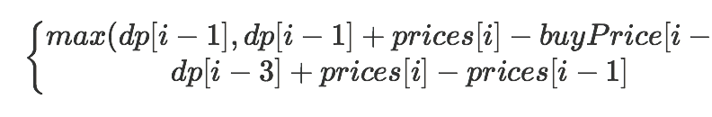

[题目链接](https://leetcode-cn.com/problems/best-time-to-buy-and-sell-stock-with-cooldown/solution/yi-ge-fang-fa-tuan-mie-6-dao-gu-piao-wen-ti-by-lab/)
#### 题目分析
* 拿到这道题，直接想到动态规划法，我们用buyPrice表示第i-1天的最大利润时的买入股票值,dp[i] =max 


我们只需要注意更新buyPrice的值即可，代码如下：
```Python
class Solution:
    def maxProfit(self, prices: List[int]) -> int:
        if prices is None or len(prices)==0:
            return 0
        buyPrice,dp = prices[:],[0]*len(prices)
        for i in range(1,len(prices)):
            if prices[i]>buyPrice[i-1]:
                dp[i] = dp[i-1] + prices[i]-buyPrice[i-1]
                buyPrice[i] = prices[i]
            else:
                dp[i] = dp[i-1]
                if dp[i]>0:
                    buyPrice[i] = buyPrice[i-1]
            if i-3>=0 and dp[i-3]+prices[i]-prices[i-1]>dp[i]:
                dp[i] = dp[i-3]+prices[i]-prices[i-1]
                buyPrice[i]=prices[i]
        return dp[len(dp)-1]  
```